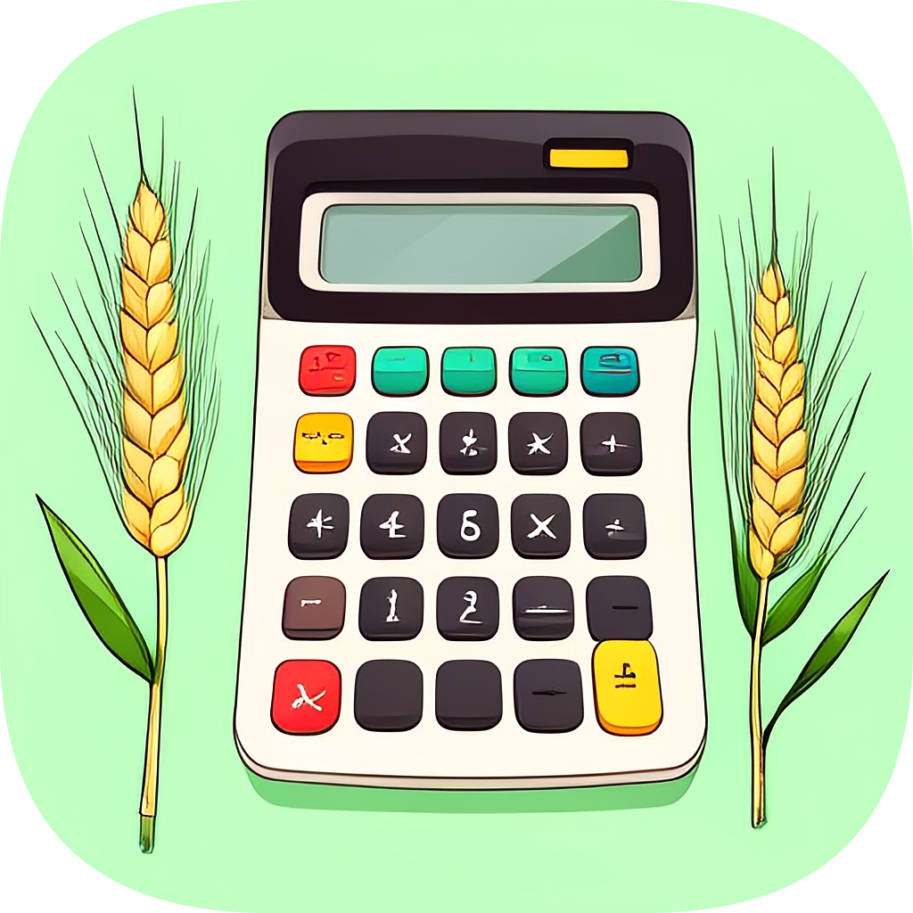
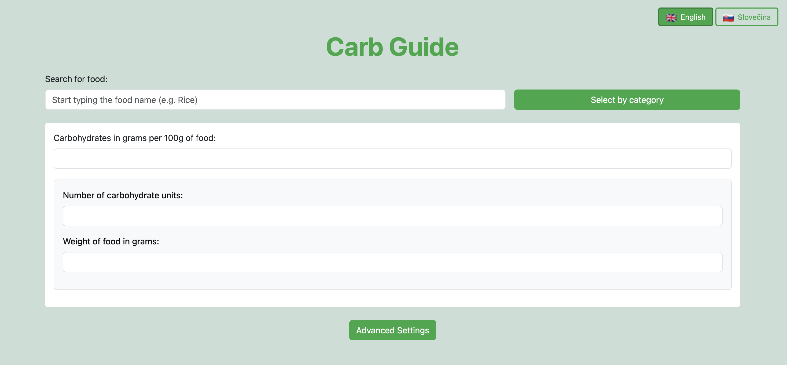
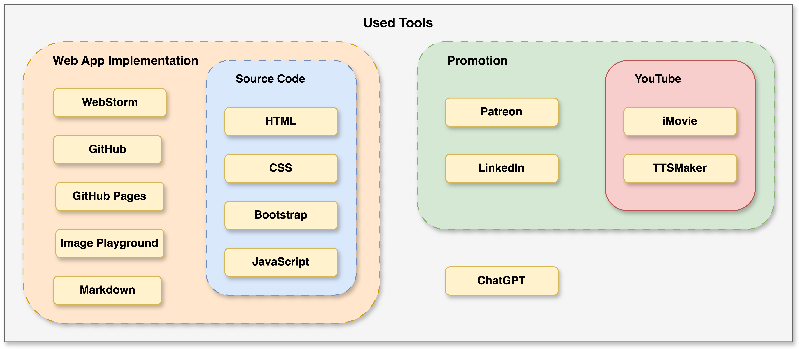
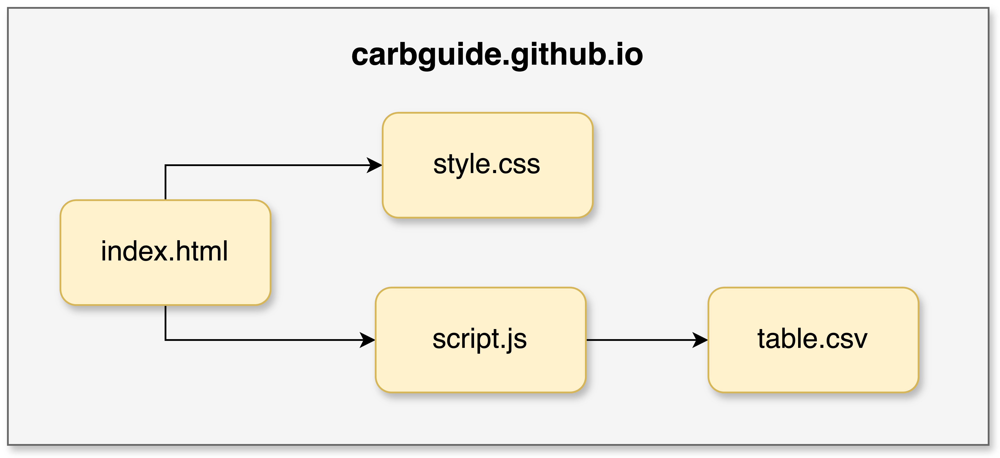

# Carb Guide

### Links
- [Website](https://carbguide.github.io/)
- [Patron](https://www.patreon.com/carbguide)
- [YouTube](https://www.youtube.com/@carbguide)
- [LinkedIn](https://www.linkedin.com/in/carb-guide-5b2528349/)

## Description
 Carb Guide is a simple web app that helps people with diabetes convert grams of carbs to carb servings and vice versa. It also provides information about the carb content of various foods. The app is free to use and has no ads or tracking.

## Motivation
I created Carb Guide to help people with diabetes manage their carb intake. It is very important for people with diabetes to keep track of their carbohydrate intake. I wanted to create a simple, easy-to-use tool that would help people with diabetes make better food choices and manage their blood sugar levels.

## Features
Features of Carb Guide are divided into functional and non-functional requirements.

### Functional
- convert carb servings to grams 
- convert grams to carb servings
- input grams of carbs in 100g of food
- search for food by name
- search for food by category
- change carb serving size
- change language between English and Slovak
- save changes to cookies

### Non-functional
- responsive design
- fast loading times
- easy to use
- easy to deploy
- free to deploy 
- easy to maintain
- free to use
- no ads
- no tracking
- open-source

## Business Model
The business model of Carb Guide is based on donations from users. Users can support the project by becoming a patron on Patreon. 

## Technologies

The app was built with tools shown in the image below. These tools are listed and described in the following sections with their exact usage in the project.

### Web App Implementation
The web app was implemented using the following tools:

**[WebStorm](https://www.jetbrains.com/webstorm/)**
- IDE for web development
- Created by JetBrains
- Used for writing code

**[GitHub](https://github.com/)**
- Version control system
- Used for storing and sharing code
- Used for deploying the web app

**[GitHub Pages](https://pages.github.com/)**
- Free static site hosting
- Custom domain
- Used for hosting the web app

**[Image Playground](https://apps.apple.com/us/app/image-playground/id6479176117)**
- App for creating images from text
- Used for creating the logo

**[Markdown](https://www.markdownguide.org/)**
- Lightweight markup language
- Used for writing documentation

#### Source Code
These are the tools used for writing the source code:

**[HTML](https://html.spec.whatwg.org/)**
- For creating the structure of the web app
- Used for creating the content

**[CSS](https://www.w3.org/Style/CSS/Overview.en.html)**
- For styling the web app
- Used for creating the design

**[Bootstrap](https://getbootstrap.com/)**
- For building design and layout
- Helps create responsive design
- Used for creating the layout

**[Javascript](https://www.javascript.com/)**
- For creating dynamic content
- Used for creating the functionality
- Used for creating the multi-language support

### Promotion

**[Patreon](https://www.patreon.com/)**
- Membership platform
- Used for financially supporting the project

**[LinkedIn](https://www.linkedin.com/)**
- Professional networking site
- Used for promoting the project

**[YouTube](https://www.youtube.com/)**
- Video sharing platform
- Used for promoting the project

**[iMovie](https://www.apple.com/imovie/)**
- Video editing software
- Used to edit the tutorial video
- Used to add music to the tutorial video

**[TTSMaker](https://ttsmaker.com)**
- Text-to-speech website
- Used to create the voiceover for the tutorial video

### General Tools
**[ChatGPT](https://www.openai.com/chatgpt)**
- AI chatbot
- Created by OpenAI
- Used to help implement the web
- Used to create promotional content
- Used to help with the script for the tutorial video

## Architecture
The app havs simple architecture with 4 files:

- `index.html` - main file with HTML structure
- `style.css` - file with CSS styles
- `script.js` - file with Javascript code
- `table.csv` - file with food data in CSV format

## Food Data
The food data is stored in a CSV file called `table.csv`. The file contains the following columns:

| id | name_en     | name_sk      | category_en | category_sk | carbsPer100g |
| -- | ----------- | ------------ | ----------- | ----------- |---------------|
| 1  | white bread | biely chlieb | bread       | chlieb      | 50            |
| 2  | apple       | jablko       | fruit       | ovocie      | 12            |
| 3  | pear        | hruška       | fruit       | ovocie      | 9             |
