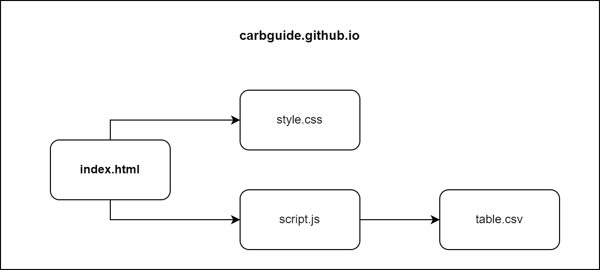

# Carb Guide
### Links
- [Website](https://carbguide.github.io/)
- [Patron](https://www.patreon.com/carbguide)
- [YouTube](https://www.youtube.com/@carbguide)
- [LinkedIn](https://www.linkedin.com)

## Description
 Carb Guide is a simple web app that helps people with diabetes convert grams of carbs to carb servings and vice versa. It also provides information about the carb content of various foods. The app is free to use and has no ads or tracking.

## Motivation
I created Carb Guide to help people with diabetes manage their carb intake. It is very important for people with diabetes to keep track of your carb intake. I wanted to create a simple, easy-to-use tool that would help people with diabetes make better food choices and manage their blood sugar levels.

## Features
Features of Carb Guide are divided into functional and non-functional requirements.

### Functional
- convert carb servings to grams 
- convert grams to carb servings
- input grams of carbs in 100g of food
- search for food by name
- search for food by category
- change carb serving size
- change language between English and Slovak

### Non-functional
- responsive design
- fast loading times
- easy to use
- easy to deploy
- free to deploy 
- easy to maintain
- free to use
- no ads
- no tracking
- open-source

## Design

### Technologies

Used technologies are:

**[GitHub Pages](https://pages.github.com/)**
- Free static site hosting
- Custom domain

**[Bootstrap](https://getbootstrap.com/)**
- For building design and layout
- Helps create responsive design

**[Javascript](https://www.javascript.com/)**
- For creating dynamic content

### Structure
The app havs simple architecture with 4 files:

- `index.html` - main file with HTML structure - for english version
- `sk.html` - main file with HTML structure - for slovak version 
- `style.css` - file with CSS styles
- `script.js` - file with Javascript code
- `table.csv` - file with food data in CSV format

### Food Data
The food data is stored in a CSV file called `table.csv`. The file contains the following columns:

| id | name_en     | name_sk      | category_en | category_sk | carbsPer100g |
| -- | ----------- | ------------ | ----------- | ----------- |---------------|
| 1  | white bread | biely chlieb | bread       | chlieb      | 50            |
| 2  | apple       | jablko       | fruit       | ovocie      | 12            |
| 3  | pear        | hruška       | fruit       | ovocie      | 9             |
